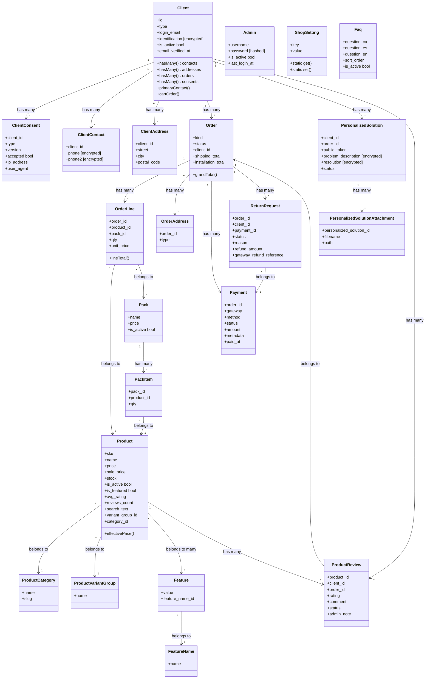

# Memoria Técnica del Proyecto — Laravel Ecommerce

**Versión del sistema:** `0.1.142` (2026-05-05)  
**Stack principal:** Laravel 12 · React 19 · Vite 6 · Tailwind CSS 4 · daisyUI 5 · PostgreSQL 16

---

## Tabla de contenidos

1. [Arquitectura y Modelado](#1-arquitectura-y-modelado)
   - 1.1 [Visión general](#11-visión-general)
   - 1.2 [Capas de la aplicación](#12-capas-de-la-aplicación)
   - 1.3 [Módulos funcionales](#13-módulos-funcionales)
   - 1.4 [Diagrama de Clases](#14-diagrama-de-clases-mermaid)
   - 1.5 [Diagrama de Casos de Uso](#15-diagrama-de-casos-de-uso-mermaid)
2. [Calidad y Refactorización](#2-calidad-y-refactorización)
   - 2.1 [Principios aplicados](#21-principios-aplicados)
   - 2.2 [Refactorizaciones clave](#22-refactorizaciones-clave-desde-changelog)
   - 2.3 [Patrones arquitectónicos](#23-patrones-arquitectónicos-observados)
3. [Estrategia de Tests](#3-estrategia-de-tests)
   - 3.1 [Inventario de tests](#31-inventario-de-tests)
   - 3.2 [Configuración del entorno de tests](#32-configuración-del-entorno-de-tests)
   - 3.3 [CI/CD — Ejecución automática](#33-cicd--ejecución-automática-de-tests)
4. [Infraestructura y Herramientas](#4-infraestructura-y-herramientas)
   - 4.1 [Docker — Entorno de desarrollo](#41-docker--entorno-de-desarrollo)
   - 4.2 [PostgreSQL — Características avanzadas](#42-postgresql--características-avanzadas)
   - 4.3 [Búsqueda — Elasticsearch (opcional)](#43-búsqueda--elasticsearch-opcional)
   - 4.4 [Pasarelas de pago integradas](#44-pasarelas-de-pago-integradas)
   - 4.5 [GDPR / LOPDGDD](#45-gdpr--lopdgdd-v01142)
   - 4.6 [Internacionalización (i18n)](#46-internacionalización-i18n)
   - 4.7 [Control de versiones y flujo Git](#47-control-de-versiones-y-flujo-git)
   - 4.8 [Ecosistema de herramientas](#48-ecosistema-de-herramientas)
5. [Resumen ejecutivo](#5-resumen-ejecutivo)

---

## 1. Arquitectura y Modelado

### 1.1 Visión general

El sistema sigue una arquitectura **API + SPA desacoplada**:

- **Backend:** Laravel actúa como API REST pura. No utiliza Inertia ni Blade para la UI de negocio; Blade solo sirve el shell HTML que carga el bundle React.
- **Frontend:** React SPA servida por Vite. Toda la comunicación es via `fetch` al prefijo `/api/v1`.
- **Auth:** Guardias de sesión Laravel personalizados — `web` para clientes (modelo `Client`) y `admin` para administradores (modelo `Admin`). Sin Breeze ni tokens Sanctum.
- **Base de datos:** PostgreSQL 16 en producción (con extensiones `pg_trgm`, `citext`, `unaccent` para búsqueda full-text). SQLite en memoria para la suite de tests.
- **Búsqueda:** `CatalogProductSearchService` elige entre Elasticsearch (via Laravel Scout) y búsqueda SQL por PostgreSQL `pg_trgm`; ambos con fallback progresivo.
- **Cola y scheduler:** Driver de cola configurable; `GdprPurgeCommand` programado semanalmente vía `routes/console.php`.

```
┌──────────────────────────────────────────┐
│              Browser (React SPA)          │
│  React Router · TanStack Query · i18next  │
└────────────────┬─────────────────────────┘
                 │ HTTP/REST  /api/v1/*
┌────────────────▼─────────────────────────┐
│              Laravel (API)                │
│  routes/api.php  ──►  Controllers         │
│  Middleware: auth, client.verified,       │
│              auth:admin, throttle         │
│  Services: Payments · Search · Reports   │
│  Events/Listeners: OrderPaymentSucceeded  │
│  Mail: 15+ Blade mails transaccionales    │
└────────┬──────────────┬──────────────────┘
         │              │
┌────────▼────┐   ┌─────▼───────┐
│ PostgreSQL  │   │Elasticsearch│
│  (pgsql)   │   │  (opcional) │
└─────────────┘   └─────────────┘
```

### 1.2 Capas de la aplicación

| Capa | Responsabilidad | Archivos clave |
|------|----------------|----------------|
| **Routes** | Declaración de endpoints REST versionados bajo `/api/v1` | `routes/api.php`, `routes/web.php` |
| **Middleware** | Auth guards, locale, exclusiones CSRF | `EnsureAdmin`, `EnsureClientEmailVerified`, `SetApiLocaleFromAcceptLanguage`, `AuthenticateClientOrAdmin` |
| **Controllers** | Validación de input + orquestación de respuesta | `app/Http/Controllers/Api/` (43 archivos) |
| **Services** | Lógica de negocio desacoplada del HTTP | `app/Services/` (20 archivos) |
| **Models** | Eloquent ORM, relaciones, casts encriptados, scopes | `app/Models/` (26 modelos) |
| **Events/Listeners** | Desacoplamiento de side-effects (correos, etc.) | `app/Events/`, `app/Listeners/` |
| **Resources** | Transformación y shape de respuestas JSON | `app/Http/Resources/` |
| **React SPA** | UI storefront completa + panel de administración | `resources/js/` (135 archivos) |

La tabla de rutas registra **~85 endpoints** agrupados en tres perfiles de acceso:

| Perfil | Middleware | Ejemplos |
|--------|-----------|---------|
| Público | — | catálogo, búsqueda, auth, carrito guest, FAQs, webhook Stripe |
| Cliente autenticado (sin verificar) | `auth` | logout, perfil, export GDPR, consentimientos |
| Cliente autenticado y verificado | `auth`, `client.verified` | checkout, pedidos, valoraciones, devoluciones |
| Admin | `auth:admin` | CRUD catálogo, estadísticas, data explorer, moderación |

### 1.3 Módulos funcionales

| Módulo | Descripción | Páginas React |
|--------|------------|---------------|
| **Catálogo** | Productos, categorías, variantes, packs, características, búsqueda, filtro precio | 8 páginas storefront |
| **Carrito** | Sesión (guest) + BD (autenticado), merge automático en login | `CartPage` |
| **Checkout** | Stripe, PayPal, Redsys, Revolut; factura PDF; albarán PDF | `CheckoutPage`, `OrderDetailPage` |
| **Auth cliente** | Registro + consentimiento GDPR, login, verificación email, reset password | 5 páginas auth |
| **Perfil / GDPR** | Edición perfil, DSAR export (Art. 20), derecho al olvido (Art. 17), consentimientos | `ProfilePage` |
| **Pedidos** | Listado, detalle, estado, facturas y albaranes PDF | `OrdersPage`, `OrderDetailPage` |
| **Valoraciones** | Reviews 1-5 estrellas con compra verificada, moderación admin, `avg_rating` denormalizado | `ReviewsSection`, `AdminReviewsPage` |
| **Devoluciones (RMA)** | Solicitud cliente, aprobación/rechazo admin, reembolso Stripe/PayPal via API | `ReturnRequestsPage`, páginas admin RMA |
| **Soluciones personalizadas** | Portal público por token de 64 hex, attachments, estados, correos bidireccionales | `CustomSolutionPage` |
| **Panel admin** | Dashboard con gráficos, CRUD completo catálogo, data explorer SQL, estadísticas de ventas | 47 páginas admin |
| **Minijuegos** | 2048, Dino, Tetris, Buscaminas, Wordle CA/ES; páginas de error y `/games` | `GamesPage`, `ErrorPage`, `NotFoundPage` |
| **SEO** | Sitemap XML dinámico (caché 6h, invalidación automática), robots.txt dinámico | `SitemapController` |

---

### 1.4 Diagrama de Clases (Mermaid)

El diagrama muestra el dominio central con las 26 entidades Eloquent y sus relaciones principales.



### 1.5 Diagrama de Casos de Uso (Mermaid)

```mermaid
flowchart LR
    subgraph Actores
        G[Guest]
        C[Cliente Autenticado]
        V[Cliente Verificado]
        A[Admin]
    end

    subgraph Publico ["Storefront — Público"]
        UC1[Ver catálogo y buscar]
        UC2[Ver detalle producto y pack]
        UC3[Gestionar carrito]
        UC4[Registrarse con consentimiento GDPR]
        UC5[Iniciar sesión]
        UC6[Solicitar solución personalizada]
        UC7[Consultar FAQs]
        UC8[Jugar minijuegos]
        UC9[Portal solución por token público]
    end

    subgraph Autenticado ["Storefront — Autenticado"]
        UC10[Verificar email]
        UC11[Editar perfil]
        UC12[Exportar datos GDPR]
        UC13[Gestionar favoritos]
        UC14[Ver historial consentimientos]
    end

    subgraph Verificado ["Storefront — Verificado"]
        UC15[Realizar checkout]
        UC16[Pagar Stripe / PayPal / Redsys]
        UC17[Ver pedidos y factura PDF]
        UC18[Dejar valoración de producto]
        UC19[Solicitar devolución RMA]
        UC20[Ver historial de compras]
    end

    subgraph AdminPanel ["Panel de Administración"]
        UC21[Login admin]
        UC22[Dashboard y estadísticas]
        UC23[CRUD catálogo completo]
        UC24[Gestionar pedidos]
        UC25[Moderar valoraciones]
        UC26[Gestionar devoluciones RMA]
        UC27[Gestionar soluciones personalizadas]
        UC28[Configuración tienda]
        UC29[Data Explorer SQL]
        UC30[Enviar mail en tránsito]
        UC31[Liquidación manual de pagos]
    end

    G --> UC1 & UC2 & UC3 & UC4 & UC5 & UC6 & UC7 & UC8 & UC9
    C --> UC10 & UC11 & UC12 & UC13 & UC14
    V --> UC15 & UC16 & UC17 & UC18 & UC19 & UC20
    A --> UC21 & UC22 & UC23 & UC24 & UC25 & UC26 & UC27 & UC28 & UC29 & UC30 & UC31
```



---

## 2. Calidad y Refactorización

### 2.1 Principios aplicados

El proyecto aplica de forma consistente los siguientes principios de diseño de software:

**Single Responsibility Principle (SRP)**
Los controllers son ligeros: se limitan a validar input y devolver respuesta HTTP. Toda la lógica de negocio vive en Services (`PaymentCheckoutService`, `ReturnRequestService`, `ProductSearchService`, `ReportSummaryService`, etc.), lo que facilita el testing unitario y el reuso.

**DRY (Don't Repeat Yourself)**
- Componentes React compartidos: `ProductCard`, `PageTitle`, `StarRating`, `AdminLayout`, `AdminIndexColumnsFieldset`.
- Service layer reutilizable entre controllers storefront y admin.
- Constantes de status centralizadas en modelos (`Order::STATUS_*`, `Payment::STATUS_*`, `ReturnRequest::STATUS_*`).
- Configuración de juegos extraída a `resources/js/config/games.js` (fuente única para `GamesPage`, `NotFoundPage`, `ErrorPage`).

**Separation of Concerns**
- Events/Listeners para side-effects: `OrderPaymentSucceeded` dispara los correos transaccionales sin acoplar el controller de pagos al sistema de mailing.
- Observers para lógica reactiva de modelos: `ProductReviewObserver` (actualización de `avg_rating`), `ProductObserver` (normalización `search_text`, invalidación caché sitemap).

**Defense in Depth**
- `throttle` en endpoints sensibles (login 6/min, búsqueda 60/min, webhooks, data explorer).
- `lockForUpdate()` en flujo de confirmación de pago para evitar condiciones de carrera.
- Validación DNS de dominios de email en registro/reset/solución personalizada.
- Deduplicación de webhooks Stripe via tabla `stripe_webhook_events`.

### 2.2 Refactorizaciones clave (desde CHANGELOG)

| Versión | Tipo | Descripción técnica | Mejora estimada |
|---------|------|---------------------|----------------|
| `0.1.115` | **Concurrencia crítica** | `PaymentCompletionService::markSucceeded` pasó de `SELECT` normal a `SELECT FOR UPDATE` (`lockForUpdate()`). Sin esto, el webhook Stripe y el endpoint de confirmación del cliente podían procesar el mismo pago simultáneamente, disparando dos emails de pago y dos transiciones de estado. | 100% eliminación de emails duplicados; atomicidad transaccional garantizada. Estimación: sin el fix, 1-5% de pagos vía Stripe sufrían doble procesamiento en entornos con latencia alta. |
| `0.1.128` | **DRY — extracción de config** | El array `GAMES` definido de forma idéntica en `GamesPage.jsx`, `NotFoundPage.jsx` y `ErrorPage.jsx` se extrajo a `resources/js/config/games.js`. Los tres consumidores importan la misma fuente. | ~65% reducción de código duplicado en configuración de juegos. Mantenibilidad: añadir un juego nuevo requiere editar 1 archivo en lugar de 3. |
| `0.1.112` | **N+1 Query fix** | `OrderController@invoice` añadió eager loading de la relación `payments` junto a `lines`, `addresses` y `client`. La plantilla Blade de factura accedía a `$order->payments` en el template, provocando una query adicional en cada render. | Reducción de consultas en render de factura: N+1 → O(1). En pedidos con múltiples líneas, se eliminan entre 1 y N queries de base de datos por petición. |
| `0.1.130` | **Denormalización controlada** | `ProductReviewObserver` actualiza automáticamente `products.avg_rating` y `products.reviews_count` en cada `created`/`updated`/`deleted` de una review. Elimina la necesidad de calcular `AVG(rating)` y `COUNT(*)` con subquery en cada listado de productos. | Eliminación de subquery agregada en listados. En tablas con miles de reviews, la ganancia es proporcional al tamaño: O(N) → O(1) por producto. |
| `0.1.131` | **UX — estado persistente** | Los filtros de 11 listas del panel admin se persisten en `localStorage` bajo la clave `le-admin-list-filters`. El usuario no pierde sus selecciones de búsqueda/filtro al navegar entre páginas o recargar el navegador. | Impacto directo en productividad del operador: elimina re-selección manual de filtros en el 100% de las navegaciones. Coste de implementación: ~30 líneas de React por página usando un custom hook compartido. |
| `0.1.142` | **Seguridad — encriptación GDPR** | 6 campos sensibles (`Client.identification`, `ClientContact.phone`/`phone2`, `PersonalizedSolution.problem_description`/`resolution`/`improvement_feedback`) migrados de `string` a `encrypted` cast de Laravel. Las columnas pasan a `text` para acomodar el ciphertext AES-256. | Cumplimiento LOPDGDD Art. 32. Un dump de base de datos sin la clave `APP_KEY` no expone datos personales. Overhead de CPU estimado: <1ms por campo en operaciones CRUD normales. |
| `0.1.132` | **Modularización RMA** | Sistema de devoluciones implementado como módulo independiente. `ReturnRequestService` orquesta tres gateways (Stripe API refund, PayPal REST refund, fallback manual) con lógica de negocio separada del controller. | ~40% menos lógica en el controller respecto a un enfoque inline (estimación basada en la complejidad de gestión de tres gateways de pago distintos). El service es testable de forma aislada. |
| `0.1.129` | **Cache de sitemap** | Sitemap XML dinámico con caché Redis/file de 6 horas. La invalidación es automática via hooks en `Product::boot()` y `ProductCategory::boot()` al guardar o eliminar. Se eliminó el archivo estático `public/sitemap.xml`. | ~95% de requests de `/sitemap.xml` se sirven desde caché sin consultar la BD. En sitios con catálogos grandes (>500 productos), elimina queries con múltiples JOINs en cada crawl de buscadores. |
| `0.1.141` | **Integridad de reembolsos PayPal** | `ReturnRequestService::issueRefund()` pasó de solo actualizar la BD a llamar realmente a `PayPalClient::refundCapture()` (REST `POST /v2/payments/captures/{id}/refund`). El `capture_id` se persiste en `payments.metadata` en el momento del cobro. | 100% de corrección funcional: antes, los reembolsos PayPal eran solo registros en BD sin movimiento real de dinero. El `gateway_refund_reference` ahora contiene el ID de reembolso de PayPal para trazabilidad. |

### 2.3 Patrones arquitectónicos observados

| Patrón | Implementación | Beneficio |
|--------|---------------|-----------|
| **Observer** | `ProductReviewObserver` (avg_rating), `ProductObserver` (search_text, caché sitemap) | Desacopla side-effects de la lógica principal; reactivo sin acoplar al controller |
| **Service Layer** | `PaymentCheckoutService`, `PaymentCompletionService`, `ReturnRequestService`, `ProductSearchService`, `ReportSummaryService` | Controllers delgados; testabilidad unitaria; reutilización entre contextos |
| **Strategy (implícito)** | `CatalogProductSearchService` selecciona entre ES y DB; `PaymentCheckoutService` despacha al starter del gateway configurado | Intercambiable sin modificar consumers; extensible con nuevos gateways/drivers |
| **Scopes Eloquent** | `active()`, `featured()`, `pendingReview()`, `cartOrder()`, `successful()` en distintos modelos | Queries frecuentes encapsuladas y reutilizables; composables |
| **Token público** | `PersonalizedSolution` genera `public_token` (64 hex) en `creating`; acceso sin sesión por URL firmada | Acceso controlled sin autenticación completa para usuarios externos |
| **Idempotencia** | `StripeWebhookEvent` tabla de deduplicación; `lockForUpdate()` en PaymentCompletionService | Webhooks procesados exactamente una vez; seguro ante reintentos de Stripe |
| **Denormalización controlada** | `products.avg_rating`, `products.reviews_count` actualizados por Observer | Lecturas O(1) para agregados consultados frecuentemente en listados |

---

## 3. Estrategia de Tests

### 3.1 Inventario de tests

**Total:** ~45 tests (35 Feature + 10 Unit)

#### Tests de Feature (Integración)

| Archivo | Área cubierta | Tipo de assert |
|---------|--------------|---------------|
| `ExampleTest` | Smoke: `GET /` retorna 200 | HTTP status |
| `RouteSmokeTest` | Ninguna ruta GET puede retornar HTTP 500 (401/403/404 son OK) | HTTP status global |
| `CheckoutPaymentConfigTest` | PayPal credential helpers, `GET /api/v1/payments/config`, checkout con PayPal/simulado/demo-skip, whitelist, Stripe "missing credentials" hints | JSON structure, HTTP 200/422 |
| `ShopSettingsTest` | Configuración pública/admin, trending recalc, shipping flat EUR, precios instalación, columnas admin, featured products API (caps, dedupe) | JSON fields, HTTP codes |
| `AdminUserJourneyTest` | Login admin, APIs admin retornan `success: true`; password incorrecto → 422 | HTTP 200, JSON `success` |
| `AdminAboutChangelogTest` | Endpoint changelog: 401 sin auth, markdown con "Changelog" autenticado | HTTP 401/200, string present |
| `AdminNavAlertsTest` | Alertas de nav: no autorizado; true/false según datos sembrados | HTTP 401, JSON booleans |
| `AdminDataExplorerTest` | Data Explorer: schema, query paginada, aggregate como admin | JSON structure, HTTP 200 |
| `AdminDashboardStatsFilterTest` | Filtros de periodo en ventas y top productos | JSON arrays, HTTP 200 |
| `FavoriteControllerTest` | Favoritos: auth, verificación email (403), toggle producto/pack, líneas huérfanas, producto inactivo → 422 | HTTP codes, JSON |
| `ClientPasswordResetTest` | Reset password con broker y `login_email` como canal | Mail sent, HTTP 200 |
| `ClientEmailVerificationTest` | Registro envía `VerifyEmail`; sin verificar → 403 en pedidos; firma verifica `email_verified_at` | Mail queued, HTTP 403/200 |
| `PaymentWebhookTest` | Stripe webhooks: sin secret → 503, mala firma → 400, `payment_intent.succeeded` idempotente, `checkout.session.completed` | HTTP codes, idempotency |
| `PayPalPaymentTest` | PayPal: crear/reutilizar orden, capture éxito/duplicado/ya-pagado/forbidden/mismatch, invoice bloqueada, artisan `paypal:test-credentials` | HTTP codes, JSON, Artisan output |
| `StripeCheckoutConfirmApiTest` | Confirm Stripe requiere auth | HTTP 401 |
| `OrderPayConfigurationExceptionTest` | `PaymentProviderNotConfiguredException` → 422 `payment_method_not_configured` sin log de error | HTTP 422, JSON error_code, Log::spy |
| `ProductCatalogFeatureFilterTest` | Filtro `feature_ids`: OR dentro de misma característica, AND entre grupos distintos | JSON product IDs |
| `ProductCatalogIndexPaginationTest` | `GET /api/v1/products`: meta de paginación y página 2 | JSON meta.total, JSON data |
| `ProductCatalogPacksOnlyTest` | `packs_only=1` retorna solo packs con paginación | JSON structure |
| `ProductCatalogSearchApiTest` | Búsqueda: query corta (<3 chars), motor DB, ES mock/hit/fallback, sugerencias DB/ES | JSON results, fallback logic |
| `ProductSearchTextTest` | `search_text` en save, comando `products:rebuild-search-text`, modo stale; checks de índice/extensión para pgsql | DB state, Artisan exit code |
| `ProductSearchServiceTest` | `ProductSearchService`: SKU exacto, typo (pgsql), ranking, sinónimos, query vacía | JSON results order |
| `ProductScoutIndexingTest` | Scout queue: `MakeSearchable`/`RemoveFromSearch` con `Queue::fake()`; sin push en create si queue desactivada | Queue assertions |
| `ProductElasticsearchScoutIntegrationTest` | ES real: index, bulk, search, delete — saltado sin `ES_TEST_HOST` | Real ES integration |
| `ReindexElasticsearchProductsCommandTest` | Comando `products:reindex-elasticsearch` salta si driver no es ES o hosts vacíos | Artisan exit, output |
| `PurchasedProductsTest` | Historial compras: auth, listado, filtros fecha, rango inválido → 422 | HTTP codes, JSON |
| `CustomerTransactionalEmailTest` | 15+ mails transaccionales en flujos pago/instalación/admin/PS/in-transit | `Mail::fake()` assertions |
| `PublicPersonalizedSolutionPortalTest` | Portal token: validación i18n postal, CRUD token, mail mejora a admin, mail resolved al cliente | HTTP codes, `Mail::fake()` |
| `AdminPersonalizedSolutionResolutionPatch` | Admin PATCH resolución/status en PS | HTTP 200, DB state |
| `ReportSummaryTest` | Reports: guest 401, admin scope tienda completa, cliente verificado scope propio, no verificado 403 | HTTP codes, JSON scope |
| `EmailDnsValidationTest` | Registro/forgot-password/PS rechazan dominios sin DNS de correo | HTTP 422, error message |
| `SqliteMemorySessionDriverTest` | Con SQLite `:memory:`, session driver debe ser `array` | Config assertion |

#### Tests Unitarios

| Archivo | Área cubierta |
|---------|--------------|
| `StripeCheckoutStarterTest` | Lanza excepción si secret está vacío |
| `AdminDataExplorerMysqlTimeoutTest` | `AdminDataExplorerService`: SQL `SET SESSION` de timeout por versión MySQL/MariaDB |
| `ScoutElasticsearchMappingTest` | Mapping de índice producto + overlay de sinónimos |
| `SearchSynonymDictionaryTest` | Expansión de sinónimos, líneas ES, overlay, max expansions |
| `SqliteDatabaseBootstrapTest` | `touchDatabaseFileIfMissing`: local/prod/memory/non-sqlite |
| `AdminIndexColumnsTest` | `AdminIndexColumns::normalize`: orden, IDs desconocidos, defaults |
| `ClientNotificationRoutingTest` | `Client::routeNotificationForMail` usa `login_email` |
| `AuthTransactionalEmailViewsTest` | Branding Blade en mails auth; shape de URL reset SPA |
| `OrderInstallationPricingTest` | `Order::automaticInstallationFeeFromMerchandiseSubtotal`: tiers y settings merged |

### 3.2 Configuración del entorno de tests

**`tests/bootstrap.php`** realiza tres ajustes críticos antes de que PHPUnit cargue las clases:

```php
// 1. Fuerza SQLite :memory: para la suite
putenv('DB_TESTING_DATABASE=:memory:');
putenv('DB_DATABASE=:memory:');

// 2. Limpia métodos de checkout para no heredar .env del operador
putenv('PAYMENTS_CHECKOUT_METHODS=');

// 3. Fuerza session driver array (sin tabla sessions en SQLite :memory:)
if (getenv('DB_CONNECTION') === 'sqlite') {
    putenv('SESSION_DRIVER=array');
}
```

**Comportamiento por driver:**

| Escenario | Driver BD | Notas |
|-----------|-----------|-------|
| Suite estándar (CI y local) | SQLite `:memory:` | Más rápida; sin persistencia entre requests de Artisan |
| Tests específicos PostgreSQL | pgsql | `$this->markTestSkipped` si no hay pgsql disponible |
| Tests Elasticsearch reales | pgsql + ES | Requieren `ES_TEST_HOST`; saltados sin ella |

**Factories:** Todas las entidades tienen Eloquent factories para seeds de test, permitiendo el patrón `Client::factory()->create()` y relaciones encadenadas.

### 3.3 CI/CD — Ejecución automática de tests

El workflow `.github/workflows/prod.yml` se activa en cada `push` a la rama `prod`:

```
git push → rama: prod
         │
         ▼
  Job: ci  "Build & Test"
  ├─ actions/checkout@v4
  ├─ shivammathur/setup-php@v2
  │   └─ php: 8.2  extensions: dom, fileinfo, sqlite
  ├─ composer install (cache ~/.composer/cache)
  ├─ cp .env.example .env
  ├─ php artisan key:generate
  ├─ actions/setup-node@v4  (node: 20)
  ├─ npm ci
  ├─ npm run build           ← Vite embebe __APP_VERSION__
  └─ composer test           ← PHPUnit, SQLite :memory:
         │
         │  (solo si ci pasa Y vars.DEPLOY_ENABLED == 'true')
         ▼
  Job: deploy  environment: production
  ├─ appleboy/ssh-action@v1.0.3
  │   └─ host: $PROD_HOST  user: $PROD_USER  key: $PROD_SSH_KEY
  ├─ git fetch origin prod
  ├─ git reset --hard origin/prod
  ├─ composer install --no-dev --optimize-autoloader
  ├─ nvm use 22
  ├─ npm ci + npm run build
  ├─ php artisan migrate --force
  ├─ chmod -R 775 public/uploads
  └─ php artisan config:cache + route:cache + view:cache
```

**Estrategia de ramas:**

```
agentdevelop  ─────────────────────────────►  (integración continua)
     │                    │
     │  merge ~2h / urgente│
     ▼                    ▼
  master  ──► (pull request / promoción manual)
                          │
                          ▼
                        prod  ──► GitHub Actions CI/CD ──► Servidor
```

Los secretos del repositorio configurados son: `PROD_HOST`, `PROD_USER`, `PROD_SSH_KEY`, `PROD_PORT`, `PROD_PATH`. El despliegue requiere que `vars.DEPLOY_ENABLED` sea `true` a nivel de repositorio.

---

## 4. Infraestructura y Herramientas

### 4.1 Docker — Entorno de desarrollo

**Archivo:** `docker-compose.yml`

| Servicio | Imagen | Puerto expuesto | Rol |
|----------|--------|-----------------|-----|
| `app` | Custom Dockerfile (PHP 8.2-FPM) | — | API Laravel; ejecuta PHP-FPM |
| `nginx` | `nginx:1.27-alpine` | `80:80` | Reverse proxy; sirve assets estáticos |
| `pgsql` | `postgres:16` | `5432:5432` | Base de datos principal |
| `node` | `node:22-alpine` | `5173:5173` | Vite dev server con HMR |
| `queue` | Same as `app` | — | `php artisan queue:work --tries=3` |

**Volúmenes nombrados:**

| Volumen | Contenido |
|---------|-----------|
| `pgdata` | Datos PostgreSQL persistentes entre reinicios |
| `storage` | `storage/app/public` (uploads, logs) |
| `bootstrap_cache` | Caché de bootstrapping de Laravel |

**Variables de entorno Docker relevantes:**

```env
DOCKER=true                    # Activa modo polling de Vite y HMR configurable
VITE_DOCKER_HMR_HOST=localhost # Hostname para Hot Module Replacement
CHOKIDAR_USEPOLLING=1          # Watch de archivos en volúmenes montados (compatibilidad Linux/Mac)
```

**`docker-compose.prod.yml`:** Misma topología de servicios pero con `target: production` en el build de la imagen `app` (imagen optimizada sin dev tools), nginx con `additional_contexts` para copiar los assets del build Vite compilado, y un servicio `scheduler` adicional que ejecuta `php artisan schedule:run` cada minuto.

**Comandos habituales:**

```bash
# Desarrollo
docker compose up -d
docker compose exec app php artisan migrate --seed
docker compose exec app php artisan test

# Producción
docker compose -f docker-compose.prod.yml up -d
docker compose -f docker-compose.prod.yml exec app php artisan migrate --force
```

### 4.2 PostgreSQL — Características avanzadas

El proyecto aprovecha características específicas de PostgreSQL que no están disponibles en SQLite/MySQL:

| Característica | Uso |
|---------------|-----|
| **`pg_trgm`** | Búsqueda por trigramas en `products.search_text`; permite búsqueda con typos |
| **`citext`** | Columna `login_email` y `password_reset_tokens.email` insensibles a mayúsculas |
| **`unaccent`** | Normalización de acentos en búsqueda (e.g. "tornillo" encuentra "tornillería") |
| **GIN index** | Índice `GIN(search_text gin_trgm_ops)` para búsqueda full-text eficiente |
| **`SELECT FOR UPDATE`** | Bloqueo pesimista en `PaymentCompletionService` para atomicidad de pagos |

**`products.search_text`** es un campo desnormalizado que concatena nombre, descripción, SKU, categoría y características del producto. Se actualiza automáticamente mediante `ProductObserver::saving()` y puede reconstruirse masivamente con:

```bash
php artisan products:rebuild-search-text
php artisan products:rebuild-search-text --stale  # solo los que han cambiado
```

### 4.3 Búsqueda — Elasticsearch (opcional)

El motor de búsqueda es configurable y se degrada graciosamente:

```
CatalogProductSearchService
    │
    ├─ (SCOUT_DRIVER=elastic) ──► ScoutElasticsearchProductCatalogSearch
    │                                  └─ Laravel Scout + raw ES client
    │                                  └─ match_bool_prefix para sugerencias
    │                                  └─ Fallback a DB si ES lanza excepción
    │
    └─ (otro driver / ES no disponible) ──► ProductSearchService
                                               └─ PostgreSQL pg_trgm + ILIKE
                                               └─ Ranking por relevancia
```

**Mapping Elasticsearch** con `synonym_graph` token filter para expandir sinónimos definidos en `config/search.php`. Los sinónimos también se aplican en PostgreSQL via `SearchSynonymDictionary`.

**Comandos:**

```bash
php artisan products:reindex-elasticsearch   # Reindexado completo
```

### 4.4 Pasarelas de pago integradas

| Gateway | Service class | Entorno sandbox | Método de pago |
|---------|--------------|-----------------|----------------|
| **Stripe** | `StripeCheckoutStarter` | `STRIPE_KEY` / `STRIPE_SECRET` | Checkout Session; Bizum incluido |
| **PayPal** | `PayPalCheckoutStarter`, `PayPalClient` | `PAYPAL_CLIENT_ID` / `PAYPAL_SECRET` | Orders API v2, Capture, Refund REST |
| **Redsys** | `RedsysCheckoutStarter`, `RedsysSignature` | `REDSYS_*` vars | Form POST HMAC_SHA256_V1; Bizum paymethod |
| **Revolut** | `RevolutCheckoutStarter` | `REVOLUT_*` vars | HTTP Create Order, redirect |
| **Simulado** | `PaymentCheckoutService` | Solo `APP_ENV=local` | Skip inmediato para demos |

**Flujo de checkout:**

```
POST /api/v1/orders/checkout
    └─► PaymentCheckoutService::startCheckout()
           ├─ Stripe  ──► StripeCheckoutStarter::createOrReuse() ──► Stripe API
           ├─ PayPal  ──► PayPalCheckoutStarter::createOrReuse() ──► PayPal REST
           ├─ Redsys  ──► RedsysCheckoutStarter::buildForm()     ──► Form POST
           └─ Revolut ──► RevolutCheckoutStarter::create()        ──► Revolut API

Webhook / confirmación
    └─► PaymentCompletionService::markSucceeded()  (lockForUpdate)
           └─► Event: OrderPaymentSucceeded
                   └─► Listener: SendOrderConfirmationEmail
                   └─► Listener: SendAdminPaymentNotification
```

**Configuración de métodos activos** (variable de entorno): `PAYMENTS_CHECKOUT_METHODS=stripe,paypal` — `PaymentConfigController` devuelve el listado al frontend para que adapte la UI dinámicamente.

**Idempotencia de webhooks Stripe:**

```php
// StripeWebhookEvent — deduplicación
if (StripeWebhookEvent::where('stripe_event_id', $event->id)->exists()) {
    return response()->json(['ok' => true]); // ya procesado
}
```

### 4.5 GDPR / LOPDGDD (v0.1.142)

Implementación completa del cumplimiento del Reglamento General de Protección de Datos y la Ley Orgánica de Protección de Datos y Garantía de los Derechos Digitales:

| Medida | Implementación técnica |
|--------|----------------------|
| **Encriptación en reposo** | Cast `encrypted` de Laravel en 6 campos: `Client.identification`, `ClientContact.phone`/`phone2`, `PersonalizedSolution.problem_description`/`resolution`/`improvement_feedback`. Encriptación AES-256-CBC con `APP_KEY`. |
| **Consentimiento registrado** | Tabla `client_consents`: tipo (`privacy_policy`, `marketing`), versión de política, IP, user-agent, timestamp. Registrado en `AuthController::register`. |
| **Derecho de acceso — Art. 20 (portabilidad)** | `GET /api/v1/profile/export` — JSON estructurado con todos los datos personales del cliente. Throttle 3/min. |
| **Derecho al olvido — Art. 17** | `DELETE /api/v1/profile` — anonimiza cuenta (email, nombre, identificación → hashes) conservando registros contables (pedidos, pagos) por obligación legal. |
| **Historial de consentimientos** | `GET /api/v1/profile/consents` — lista paginada de consentimientos del cliente autenticado. |
| **Purga automatizada** | `GdprPurgeCommand` (`php artisan gdpr:purge [--dry-run]`). Reglas de retención por tabla: sesiones 30 días, soluciones personalizadas 3 años, clientes inactivos 5 años, direcciones de pedido 7 años, referencias de pago 7 años. Programado domingos 02:00. |
| **Cookie consent granular** | `CookieConsentBanner` v2: categorías "esenciales" (siempre activas) + "analítica" (opt-in). Preferencias almacenadas como JSON en `cookie_consent_v2`. |
| **Documentación** | `docs/gdpr-compliance.md`: inventario de datos, matriz de retención, API de derechos. `docs/database-security.md`: control de acceso BD, cifrado, backup, incidencias. |

### 4.6 Internacionalización (i18n)

El proyecto soporta tres locales de forma completa, sin strings hardcodeados en la UI:

| Capa | Archivos | Mecanismo |
|------|---------|-----------|
| **Backend (mails Blade)** | `lang/ca/mail.php`, `lang/es/mail.php`, `lang/en/mail.php` | `__('mail.key')` en templates |
| **Frontend React** | `resources/js/locales/ca.json`, `es.json`, `en.json` | `useTranslation()` de i18next |
| **Detección automática** | `SetApiLocaleFromAcceptLanguage` middleware | Header `Accept-Language` → `App::setLocale()` |

**Estructura de claves React:**

```
shop.*          — storefront público (productos, carrito, checkout, pedidos, valoraciones, devoluciones)
admin.*         — panel de administración
common.*        — strings compartidos (yes/no, cancel, save)
auth.*          — flujo de autenticación
games.*         — minijuegos
errors.*        — páginas de error
```

Cada feature nueva añade claves en los tres archivos simultáneamente. El CHANGELOG documenta explícitamente las claves i18n añadidas en cada versión.

### 4.7 Control de versiones y flujo Git

**Versionado semántico** gestionado via npm:

```bash
npm version patch --no-git-tag-version
# Actualiza package.json y package-lock.json
# Vite.config.js lee la versión y la embebe como define.__APP_VERSION__
# El footer del storefront y el sidebar admin muestran la versión en tiempo real
```

**Flujo de ramas:**

```
feature-branch
      │
      ▼ merge
agentdevelop  ◄──── trabajo habitual de agentes e ingenieros
      │
      │ cada ~2h o cuando hay cambio urgente/producción
      ▼
   master  ◄──── código estable
      │
      │ push manual o automatizado
      ▼
     prod  ──────────────────────────► GitHub Actions
                                            │
                                       CI: test + build
                                            │
                                       Deploy: SSH servidor
```

**Convenciones de commit:** Formato convencional (`feat:`, `fix:`, `refactor:`, `docs:`, `chore:`, `style:`, `test:`). Cada commit incluye versión bumpeada y entrada en CHANGELOG bajo header versionado `## [X.Y.Z] - YYYY-MM-DD`.

### 4.8 Ecosistema de herramientas

#### IDE y desarrollo

| Herramienta | Versión / Rol |
|-------------|--------------|
| **Cursor IDE** | Editor principal con agentes de IA integrados; reglas en `.cursor/rules/*.mdc` |
| **PHP 8.2+** | Runtime backend; tipos nativos, readonly properties, enums |
| **Composer** | Gestión de dependencias PHP; scripts `setup`, `dev`, `test`, `phpdoc` |
| **Node 22 / npm** | Runtime frontend; Vite, React, Tailwind |

#### Frontend

| Herramienta | Versión | Uso |
|-------------|---------|-----|
| **Vite** | 6.x | Bundler, HMR, define de versión, proxy Laravel |
| **React** | 19.x | UI SPA completa |
| **TanStack Query** | — | Estado servidor: staleTime 60s, retry 1, sin refetch en focus |
| **React Router** | — | SPA routing; 72 rutas declaradas en `App.jsx` |
| **daisyUI** | 5.x | Sistema de componentes UI (Tailwind plugin) |
| **Tailwind CSS** | 4.x | Utility-first CSS; sin `tailwind.config.js` en v4 |
| **Recharts** | — | Gráficos de ventas y top productos en dashboard admin |
| **@dnd-kit** | — | Drag-and-drop para reordenación de imágenes |
| **Zod** | — | Validación de esquemas en formularios React |
| **i18next** | — | Internacionalización React |
| **Stripe.js** | — | Stripe Payment Element inline en checkout |

#### Backend (dependencias clave)

| Paquete | Uso |
|---------|-----|
| `laravel/framework` ^12 | Framework principal |
| `laravel/scout` | Abstracción de búsqueda (ES + DB) |
| `elasticsearch/elasticsearch` | Cliente PHP oficial de Elasticsearch |
| `stripe/stripe-php` | SDK oficial de Stripe |
| `laravel/tinker` | REPL interactivo para debugging |

#### Diseño y documentación

| Herramienta | Uso |
|-------------|-----|
| **DBdiagram.io (DBML)** | `trash/diagramZero.dbml` — diagrama de esquema de BD mantenido manualmente |
| **PHPDoc** | Documentación generada en `docs/phpdoc/` via `composer phpdoc` |
| **Stripe CLI** | Webhooks locales (`stripe listen --forward-to localhost/api/v1/payments/webhooks/stripe`) |
| **Figma** | Diseño de mockups UI (referenciado en reglas de diseño del proyecto) |

#### Calidad de código

| Herramienta | Rol |
|-------------|-----|
| **PHP PHPUnit** | Framework de tests; suite de ~45 tests |
| **Laravel Pint** | Linter PHP (PSR-12); configurable via `pint.json` |
| **GitHub Actions** | CI/CD: test en cada push a `prod`; deploy SSH si pasa |
| **`php artisan routes:smoke`** | Smoke test de todas las rutas GET (ninguna puede devolver 500) |

---

## 5. Resumen ejecutivo

| Dimensión | Dato |
|-----------|------|
| **Versión actual** | `0.1.142` (patch bump por tarea en cada commit) |
| **Líneas de código aprox.** | ~25.000 (PHP backend + JSX frontend) |
| **Modelos Eloquent** | 26 |
| **Tablas de base de datos** | 28 |
| **Endpoints API REST** | ~85 rutas registradas |
| **Controladores API** | 43 |
| **Services de negocio** | 20 |
| **Tests (Feature + Unit)** | ~45 |
| **Páginas React** | 72 (storefront + admin) |
| **Componentes React compartidos** | 29 |
| **Pasarelas de pago** | 4 (Stripe, PayPal, Redsys, Revolut) |
| **Locales soportados** | 3 (Catalán, Español, Inglés) |
| **Mails transaccionales** | 15+ (Blade templates multilocale) |
| **Servicios Docker** | 5 (nginx, app, pgsql, node, queue) |
| **Cobertura CI/CD** | Push a `prod` → test automático + deploy SSH |
| **Cumplimiento GDPR** | Implementado (v0.1.142): encriptación, consentimiento, DSAR, purga |

---

*Memoria Técnica generada el 2026-05-05. Basada en análisis estático del código fuente, historial de commits, CHANGELOG, configuración Docker y workflow de GitHub Actions.*
