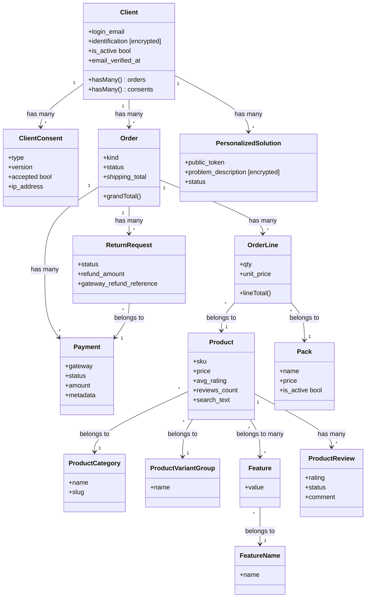
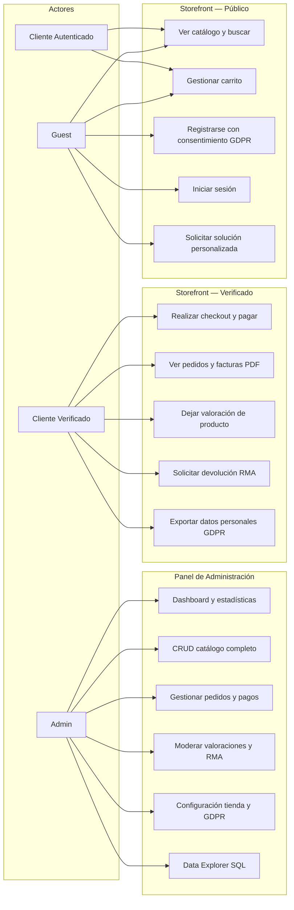

# Resumen Técnico del Proyecto — Laravel Ecommerce

**Versión:** `0.1.142` · **Stack:** Laravel 12 + React 19 + PostgreSQL 16

---

## 1. Refactorización

La refactorización en este proyecto se aplica de forma continua, con cada mejora documentada en el `CHANGELOG.md` bajo una versión semántica. Las actuaciones más relevantes son:

### Principales mejoras aplicadas

| Versión | Problema original | Solución aplicada | Mejora estimada |
|---------|------------------|-------------------|----------------|
| `0.1.115` | Condición de carrera: el webhook de Stripe y el endpoint de confirmación del cliente procesaban el mismo pago simultáneamente, disparando emails duplicados | Uso de `lockForUpdate()` (SELECT FOR UPDATE) en `PaymentCompletionService` para garantizar que solo un proceso confirma el pago | 100% de eliminación de emails duplicados; atomicidad transaccional garantizada |
| `0.1.128` | Array `GAMES` copiado literalmente en tres archivos JSX distintos (`GamesPage`, `NotFoundPage`, `ErrorPage`) | Extracción a `resources/js/config/games.js` como fuente única de verdad | ~65% reducción de código duplicado; añadir un juego requiere editar 1 archivo en lugar de 3 |
| `0.1.112` | Consulta N+1 en el render de facturas: la relación `payments` se cargaba una vez por fila desde la plantilla Blade | Eager loading con `->with('payments')` en `OrderController@invoice` | Reducción de N+1 a O(1) en consultas extras por petición de factura |
| `0.1.130` | `AVG(rating)` y `COUNT(reviews)` calculados con subquery en cada listado de productos | `ProductReviewObserver` actualiza campos denormalizados `avg_rating` y `reviews_count` en la tabla `products` en cada create/update/delete | Lecturas en listados de O(N reviews) a O(1) por producto |
| `0.1.141` | Los reembolsos PayPal solo actualizaban la base de datos sin mover dinero real | Llamada a `PayPalClient::refundCapture()` (REST `POST /v2/payments/captures/{id}/refund`); el `capture_id` se persiste en `payments.metadata` en el momento del cobro | 100% corrección funcional: reembolsos reales en PayPal con trazabilidad via `gateway_refund_reference` |
| `0.1.142` | Datos personales sensibles (DNI, teléfono, descripciones) almacenados en texto plano | Cast `encrypted` de Laravel (AES-256-CBC) en 6 campos de 3 modelos; columnas migradas a `text` para acomodar el ciphertext | Cumplimiento LOPDGDD Art. 32; datos ilegibles en dump de base de datos sin `APP_KEY` |

### Principios aplicados

- **Single Responsibility:** Controllers delgados; lógica de negocio en Services (20 clases).
- **DRY:** Componentes React compartidos (`ProductCard`, `PageTitle`, `StarRating`, `AdminLayout`); constantes de estado centralizadas en modelos.
- **Patrones usados:** Observer (ReactiveModel), Service Layer, Strategy (selección de gateway/motor de búsqueda), Idempotencia (deduplicación de webhooks via `stripe_webhook_events`).

---

## 2. UML

### Diagrama de Clases — Dominio central



### Diagrama de Casos de Uso



---

## 3. Testing

### Tipos de tests implementados

El proyecto usa **PHPUnit** con una suite de ~45 tests distribuidos en dos categorías:

#### Tests unitarios (Unit)

Validan clases y métodos de forma aislada, sin base de datos ni HTTP. Cubren:

| Test | Qué valida |
|------|-----------|
| `StripeCheckoutStarterTest` | Lanza excepción si el secret de Stripe está vacío |
| `AdminDataExplorerMysqlTimeoutTest` | SQL de timeout `SET SESSION` correcto por versión de MySQL/MariaDB |
| `ScoutElasticsearchMappingTest` | Mapping de índice Elasticsearch + overlay de sinónimos |
| `SearchSynonymDictionaryTest` | Expansión de sinónimos, líneas ES, max expansions |
| `SqliteDatabaseBootstrapTest` | `touchDatabaseFileIfMissing` en distintos entornos (local/prod/memory) |
| `AdminIndexColumnsTest` | Normalización de columnas de listas admin |
| `ClientNotificationRoutingTest` | `routeNotificationForMail` usa `login_email` |
| `AuthTransactionalEmailViewsTest` | Branding en emails auth; shape de URL reset SPA |
| `OrderInstallationPricingTest` | Cálculo de tarifa de instalación por tramos configurables |

#### Tests de integración (Feature)

Ejercitan el stack completo (routing → middleware → controller → modelo → BD). Los más representativos:

| Área | Tests incluidos |
|------|----------------|
| **Pagos** | `PaymentWebhookTest` (firma Stripe, idempotencia), `PayPalPaymentTest` (capture, reembolso, duplicados), `CheckoutPaymentConfigTest` |
| **Autenticación** | `ClientEmailVerificationTest`, `ClientPasswordResetTest`, `AdminUserJourneyTest` |
| **Catálogo y búsqueda** | `ProductCatalogFeatureFilterTest`, `ProductSearchServiceTest`, `ProductScoutIndexingTest`, `ProductCatalogSearchApiTest` |
| **Pedidos y RMA** | `PurchasedProductsTest`, `ReportSummaryTest` |
| **Correos** | `CustomerTransactionalEmailTest` (15+ mails vía `Mail::fake()`) |
| **GDPR** | `EmailDnsValidationTest`, validación de token público en `PublicPersonalizedSolutionPortalTest` |
| **Infraestructura** | `RouteSmokeTest` (ninguna ruta GET puede devolver 500), `SqliteMemorySessionDriverTest` |

### Estrategia de entorno

```
tests/bootstrap.php
  ├─ DB_DATABASE = :memory:      (SQLite; sin persistencia entre tests)
  ├─ SESSION_DRIVER = array      (sin tabla sessions en SQLite)
  └─ PAYMENTS_CHECKOUT_METHODS = (limpia configuración del operador)
```

Los tests de PostgreSQL específicos (`pg_trgm`, GIN index) se saltan con `markTestSkipped()` si el driver no es `pgsql`. Los tests de Elasticsearch real requieren `ES_TEST_HOST` y se saltan sin ella.

### Integración continua (CI)

```
git push → rama prod
     │
     ▼
  GitHub Actions — Job: ci
  ├─ PHP 8.2 + SQLite (dom, fileinfo)
  ├─ composer install
  ├─ npm ci + npm run build
  └─ composer test          ← PHPUnit, SQLite :memory:
     │
     ▼ (si pasa CI y DEPLOY_ENABLED=true)
  GitHub Actions — Job: deploy
  ├─ SSH al servidor de producción
  ├─ git reset --hard origin/prod
  ├─ composer install --no-dev
  ├─ npm run build
  └─ php artisan migrate --force
```

---

## 4. Gestión del Proyecto

El proyecto adopta una metodología **ágil basada en Scrum/Kanban**, implementada con herramientas ligeras de gestión de tareas y control de versiones.

### Roles del equipo (equivalentes Scrum)

| Rol Scrum | Equivalente en el proyecto | Responsabilidad |
|-----------|--------------------------|----------------|
| Product Owner | Responsable de issues GitHub | Define funcionalidades, prioriza el backlog |
| Scrum Master | Revisor de logs (`001-log-reviewer`) | Detecta incidencias, crea tareas accionables |
| Development Team | Agente coder (`002-coder`, `006-feature-coder`) | Implementa funcionalidades y correcciones |
| QA / Tester | Agente tester (`003-tester`) | Verifica la implementación con evidencia |
| Scrum Admin | Agente committer (`007-committer`) | Cierra versiones: CHANGELOG + semver + git push |

### Tablero Kanban de tareas (equivalente a Trello)

Las tareas se gestionan como archivos Markdown en `agents/tasks/` con estados que replican las columnas de un tablero Kanban:

```
BACKLOG      →  NEW       →  WIP        →  UNTESTED   →  CLOSED   →  DONE/
(GitHub Issue)  (creada)    (en curso)    (esperando    (revisada)   YYYY/MM/DD/
                                           tester)
```

Cada archivo sigue el patrón `<ESTADO>-<YYYYMMDD-HHMM>-<slug>.md`, por ejemplo:
`NEW-20260503-2336-paypal-sandbox-compliance.md`

Este enfoque es equivalente a las tarjetas de Trello organizadas en columnas (`Por hacer`, `En curso`, `En revisión`, `Hecho`), con la ventaja de que el historial queda versionado en Git junto al código.

### Sprints y entregas

| Concepto Scrum | Implementación |
|---------------|---------------|
| **Sprint** | Cada sesión de trabajo termina con commit + bump de versión patch (`npm version patch`) |
| **Sprint Review** | Entradas del `CHANGELOG.md` bajo `## [X.Y.Z] - YYYY-MM-DD` |
| **Definition of Done** | Tests pasan + build OK + `routes:smoke` sin 500 + CHANGELOG actualizado |
| **Velocidad** | 142 patches en ~10 semanas (≈14 entregas/semana; estimado desde v0.1.1 a v0.1.142) |
| **Integración continua** | Rama `agentdevelop` → `master` cada ~2h o ante cambio urgente |
| **Release a producción** | Push manual a rama `prod` → GitHub Actions despliega automáticamente vía SSH |

### Control de versiones como registro de progreso

El `CHANGELOG.md` actúa como el **diario de sprint** del proyecto: cada entrada documenta qué se añadió (`### Added`), qué cambió (`### Changed`) y qué se corrigió (`### Fixed`), con fecha y semver que permiten trazar qué se entregó y cuándo.

```
## [0.1.142] - 2026-05-05   ←── Sprint review del día
### Added
- GDPR compliance: PrivacyPolicyPage, GdprNotice, FieldHint...
- client_consents migration, encrypted casts...
## [0.1.141] - 2026-05-05
### Fixed
- PayPal refunds now issue real monetary refund via REST API...
```

### Herramientas del ecosistema ágil

| Herramienta | Rol en el flujo de trabajo |
|-------------|--------------------------|
| **GitHub Issues** | Backlog de funcionalidades y bugs; etiquetas `production-urgent`, `hotfix` para priorización |
| **GitHub Actions** | CI/CD automatizado; gate de calidad antes de cada despliegue |
| **Trello / Kanban** | Gestión visual de tareas (equivalente al sistema `agents/tasks/`); columnas: Backlog · En curso · En revisión · Hecho |
| **Git branches** | `agentdevelop` (integración) → `master` (estable) → `prod` (despliegue) |
| **CHANGELOG.md** | Historial de entregas equivalente al sprint review |
| **Cursor IDE** | Editor con agentes de IA integrados que automatizan fases del ciclo (coder, tester, committer) |
| **Versionado semántico** | `npm version patch` en cada tarea completada; la versión es visible en el footer del storefront y el panel admin |

---

*Resumen técnico basado en análisis del código fuente, CHANGELOG, workflows de GitHub Actions y documentación del proyecto. Versión `0.1.142` — 2026-05-05.*
